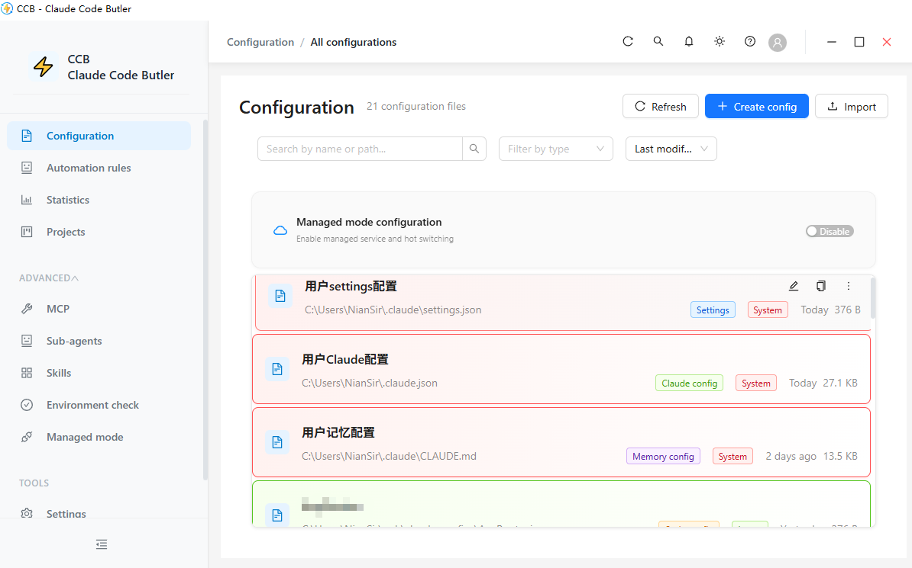
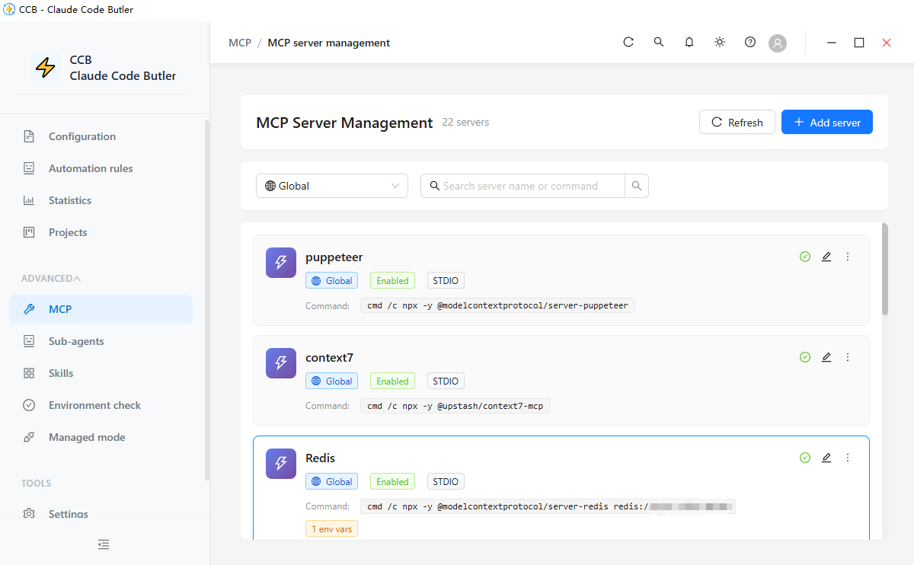
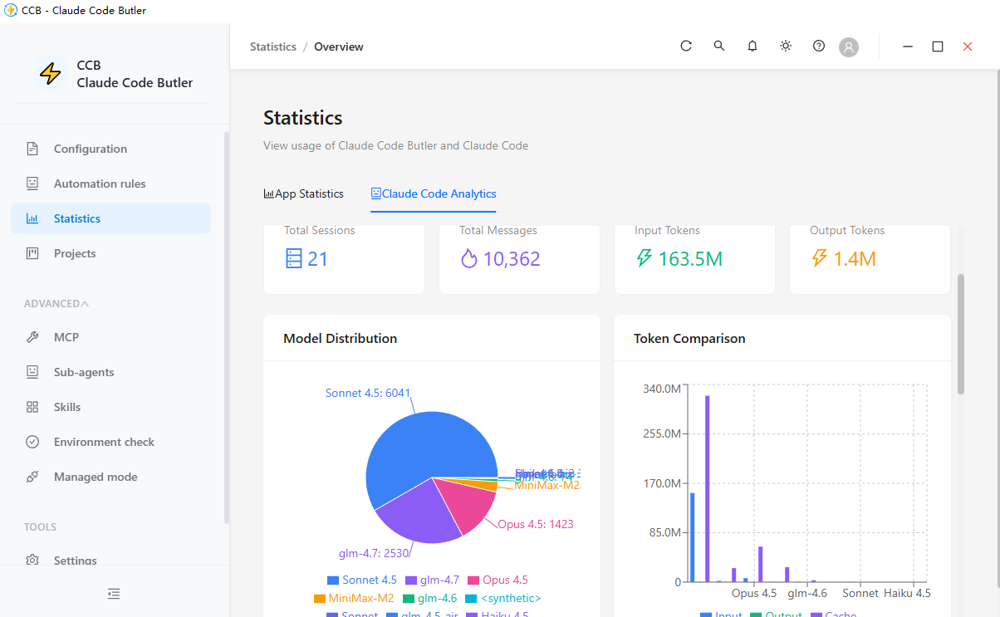
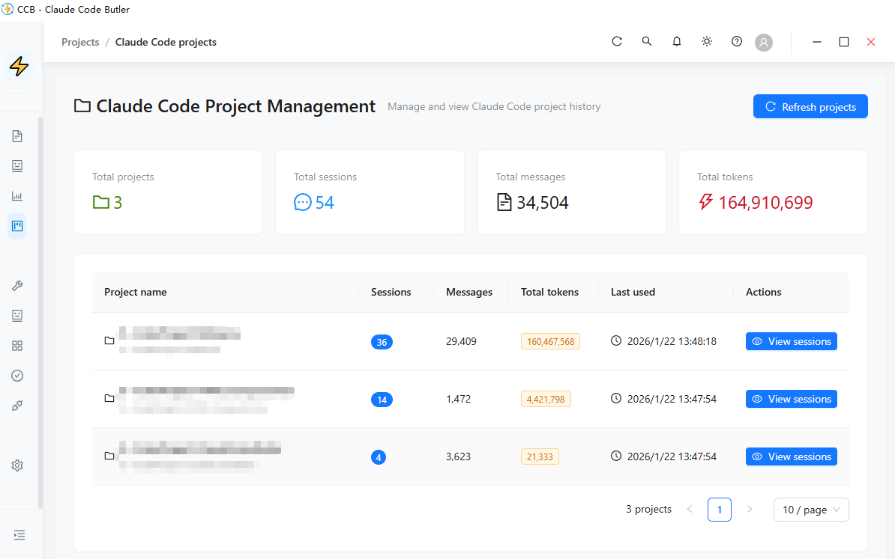
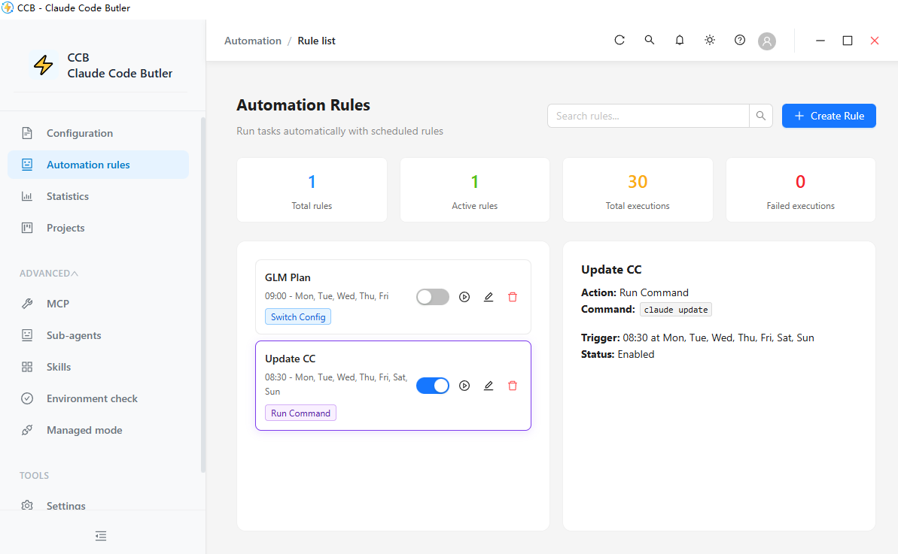
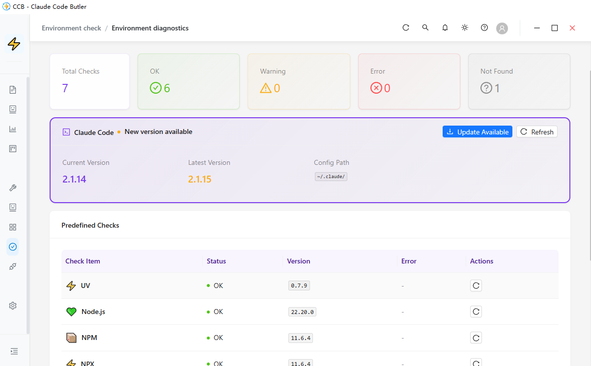
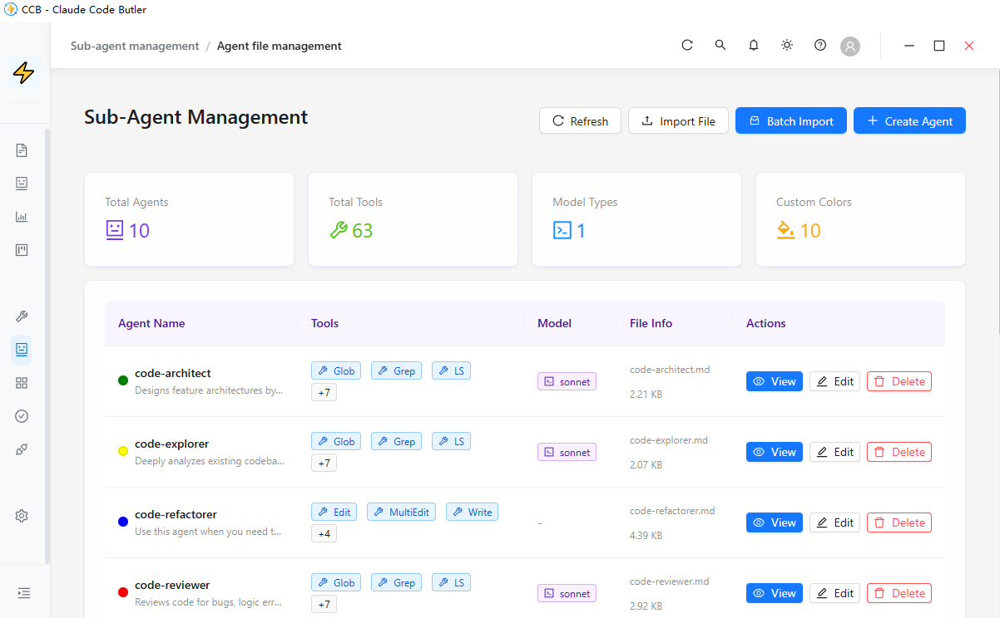
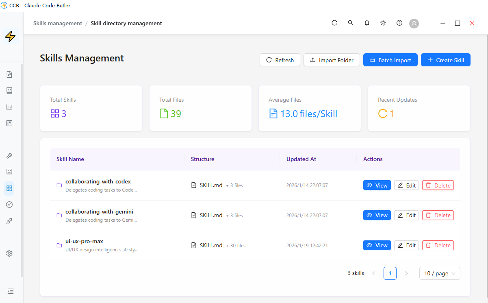

<div align="center">

# ⚡ CCB (Claude Code Butler)

**A desktop configuration workbench for Claude Code power users**

English | [简体中文](./README_CN.md)

[](https://opensource.org/licenses/MIT)
[](https://www.electronjs.org/)
[](https://react.dev/)
[](https://www.typescriptlang.org/)

</div>

---

## 📖 Introduction

CCB (Claude Code Butler) is a local-first desktop application built with Electron, React, and TypeScript for managing Claude Code related assets. It centralizes config files, MCP servers, project bindings, automation rules, environment diagnostics, and managed-mode tooling into a single interface so users can edit, validate, preview, switch, and audit their setup without manually chasing files across directories.

### ✨ Key Features

- 🎯 **Config Lifecycle Management**
  - Manage Claude Code configs, project configs, MCP configs, and user preference files from one place
  - Create, edit, copy, import, export, backup, restore, and switch configurations
  - Support both `JSON` and `Markdown`-based config types with matching validation rules
  - Preload new configs from a customizable default template configured in `Settings -> Editor Settings`

- 🔌 **MCP Server Management**
  - Manage global and project-scoped MCP servers in one panel
  - Support local command-based servers and remote `http` servers that do not require a `command`
  - Enable, disable, duplicate, import, export, archive, and validate server availability
  - Validate enabled servers through the configured global terminal runtime

- 🧠 **Editor & Settings Experience**
  - Monaco-based editor with on-demand runtime loading to keep the initial renderer lighter
  - Built-in formatting, syntax validation, and modal preview using the same editor component
  - Default new-config template editing, saving, and previewing in editor settings
  - Terminal presets, theme/language preferences, and editor behavior settings

- 🤖 **Automation & Managed Mode**
  - Trigger-condition-action automation rules with time, file, and manual execution flows
  - Managed-mode proxy tooling for request transformation, logging, diagnostics, and provider control
  - Environment checks for Claude Code and related tooling versions

- 📊 **Operations & Insights**
  - Usage analytics, model/token statistics, and project associations
  - Agent and skill management panels for advanced workflows
  - Local logging, UTF-8-safe file output, and privacy-friendly local storage

- 🌐 **Built for Daily Use**
  - Chinese and English UI
  - Windows Portable, ZIP, and NSIS installer delivery paths
  - Local-first architecture with no forced cloud dependency

---

## 📸 Screenshots

<details open>
<summary>Click to expand/collapse screenshots</summary>

### 🎛️ Configuration & Management
| Configuration Management | MCP Server Control |
|:---:|:---:|
|  |  |

### 📊 Analytics & Projects
| Usage Analytics | Project Management |
|:---:|:---:|
|  |  |

### 🚀 Automation & Environment
| Automation Rules | Environment Check |
|:---:|:---:|
|  |  |

### 🤖 Advanced Features
| Sub-Agent Management | Skills Management |
|:---:|:---:|
|  |  |

</details>

---

## 🚀 Quick Start

### Requirements

- Node.js >= 20.0.9
- npm >= 9.0.0

### Installation

```bash
# Clone the repository
git clone https://github.com/NianLog/ClaudeCodeButler.git

# Navigate to project directory
cd ClaudeCodeButler

# Install dependencies
npm install
```

### Development Mode

```bash
# Start in standard mode
npm run dev

# Start with admin privileges (required for some environment / terminal flows)
npm run dev:admin
```

### Build & Verify

```bash
# Build the application
npm run build

# Type-check
npm run type-check

# Run tests
npm test

# Launch the built app
npm start
```

---

## 📦 Packaging & Distribution

### Windows artifacts

```bash
# Portable single-file build
npm run pack:portable

# Guided installer (NSIS)
npm run pack:installer

# ZIP package
npm run pack:zip

# Unpacked directory for fast smoke checks
npm run pack:dir
```

Artifacts are emitted to `release/` by default:

- `CCB-Portable-{version}.exe` - Single-file portable build
- `CCB-Setup-{version}.exe` - Assisted installer with custom install directory and shortcut options
- `CCB-{version}-win.zip` - ZIP package
- `win-unpacked/` - Unpacked directory build

### Distribution notes

- The Portable target is convenient, but Electron Builder's single-file Portable flow extracts to a temporary directory before the app process becomes visible. On Windows, that means noticeably slower startup than `win-unpacked` or the NSIS installer.
- The NSIS installer is the recommended option when startup latency matters and a traditional installation flow is acceptable.
- The project keeps the original compressed Portable strategy to avoid large package size growth.

### Cross-platform release commands

```bash
# Default release targets for the current platform
npm run dist

# macOS
npm run dist:mac

# Linux
npm run dist:linux

# All configured platforms
npm run dist:all
```

---

## 🛠️ Tech Stack

### Application runtime

- **Electron**: 40.0.0
- **electron-vite**: 5.0.0
- **Vite**: 7.3.1
- **TypeScript**: 5.3

### Renderer

- **React**: 18.2
- **Ant Design**: 5.12
- **Zustand**: 4.4
- **Monaco Editor**: 0.55.1 via `@monaco-editor/react` 4.7
- **Recharts**: 2.8
- **react-markdown**: 9.1
- **react-syntax-highlighter**: 16.1
- **remark-gfm**: 4.0.1

### Main process & services

- **Express**: 5.1.0
- **Axios**: 1.12.2
- **Chokidar**: 3.5.3
- **node-cron**: 3.0.3
- **js-yaml**: 4.1.1
- **uuid**: 9.0.0

### Tooling & quality gates

- **Vitest**: 4.0.17
- **ESLint**: 8.57
- **electron-builder**: 26.5.0
- **patch-package**: 8.0.0

---

## 📚 Project Architecture

### Directory Structure

```text
ClaudeCodeButler/
├── src/
│   ├── main/                # Electron main process, IPC handlers, services, logging
│   ├── preload/             # Secure bridge exposed to renderer
│   ├── renderer/            # React UI, Zustand stores, pages, components, locales
│   ├── shared/              # Shared types, constants, config-template helpers
│   └── proxy-server/        # Managed-mode proxy service and related assets
├── scripts/                 # Dev/build helper scripts
├── resources/               # Icons, screenshots, packaged resources
├── docs/                    # Product, architecture, audit, and implementation docs
├── tests/                   # Unit / integration / e2e style regression coverage
└── release/                 # Packaging output
```

### Current Module Map

- **Main process modules**
  - Window, tray, scheduler, watcher, and IPC bootstrap in `src/main`
  - Domain services such as `config`, `mcp-management`, `settings`, `environment-check`, `managed-mode`, `agents-management`, `skills-management`, `statistics`, and `terminal-management`

- **Renderer modules**
  - Feature panels for Config, MCP, Automation, Managed Mode, Projects, Environment Check, Settings, Agents, and Skills
  - Zustand stores per domain for predictable UI state synchronization
  - `CodeEditor` with lazy Monaco loading and shared validation/preview behavior

- **Shared contract layer**
  - Cross-process types in `src/shared/types`
  - IPC constants and app metadata in `src/shared/constants`
  - Default new-config template helpers in `src/shared/config-template`

### IPC Communication Pattern

Main and renderer communicate through a normalized IPC result shape:

```ts
{ success: true, data: T }
{ success: false, error: string }
```

---

## 🔧 Development Guide

### Common Commands

```bash
# Development
npm run dev
npm run dev:admin

# Build / preview
npm run build
npm run preview

# Quality gates
npm run type-check
npm run lint
npm test

# Packaging
npm run pack
npm run pack:portable
npm run pack:installer
npm run pack:zip
npm run pack:dir
```

### Path Aliases

- `@/` → `src/renderer/src/`
- `@shared/*` → `src/shared/*`

### Notes for contributors

- Renderer-only dependencies are intentionally kept out of runtime `dependencies` where possible to reduce packaged size.
- Monaco is loaded at runtime instead of being part of the initial renderer dependency graph.
- On Windows, UTF-8 handling is explicitly enforced in dev and logging related flows to reduce mojibake risk.

---

## 🆕 Recent Product Updates

- Added a customizable default template for new configs in `Settings -> Editor Settings`.
- Reworked template preview so it opens in a modal and reuses the same editor capabilities for validation and formatting.
- Fixed config copy behavior to open an editor with a localized copy suffix and defer file creation until explicit save.
- Improved config-type aware validation so Markdown-based preference files are no longer forced through JSON parsing in preview flows.
- Added NSIS installer packaging as a lower-latency alternative to the single-file Portable build.

---

## 🤝 Contributing

We welcome bug reports, feature proposals, documentation improvements, and code contributions.

### Contribution Flow

1. Fork the repository
2. Create a branch (`git checkout -b feature/AmazingFeature`)
3. Commit your changes (`git commit -m "feat: add amazing feature"`)
4. Push the branch (`git push origin feature/AmazingFeature`)
5. Open a Pull Request

### Commit Convention

Use Conventional Commit prefixes:

- `feat`: New feature
- `fix`: Bug fix
- `docs`: Documentation update
- `refactor`: Refactor
- `perf`: Performance improvement
- `test`: Tests
- `chore`: Tooling / build change

---

## 📄 License

This project is licensed under the MIT License. See [LICENSE](LICENSE) for details.

---

## 🙏 Acknowledgments

Thanks to these open source projects and tools:

- [Electron](https://www.electronjs.org/)
- [React](https://react.dev/)
- [Ant Design](https://ant.design/)
- [Monaco Editor](https://microsoft.github.io/monaco-editor/)
- [Zustand](https://github.com/pmndrs/zustand)
- [Claude Code](https://claude.com/claude-code)

---

## 📮 Contact

- **Author**: NianSir
- **Project Home**: [GitHub](https://github.com/NianLog/ClaudeCodeButler)
- **Issue Tracker**: [Issues](https://github.com/NianLog/ClaudeCodeButler/issues)

---

<div align="center">

**If this project helps you, please give it a ⭐ Star!**

Made by NianSir

</div>
