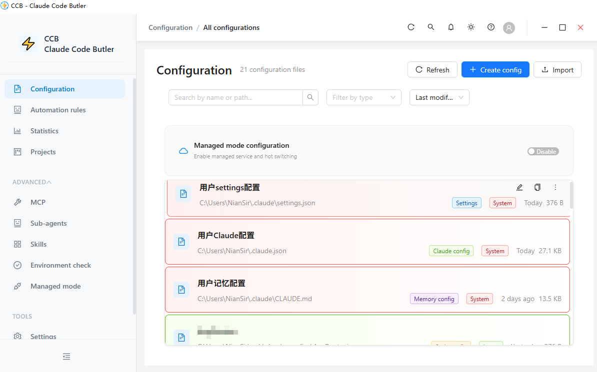
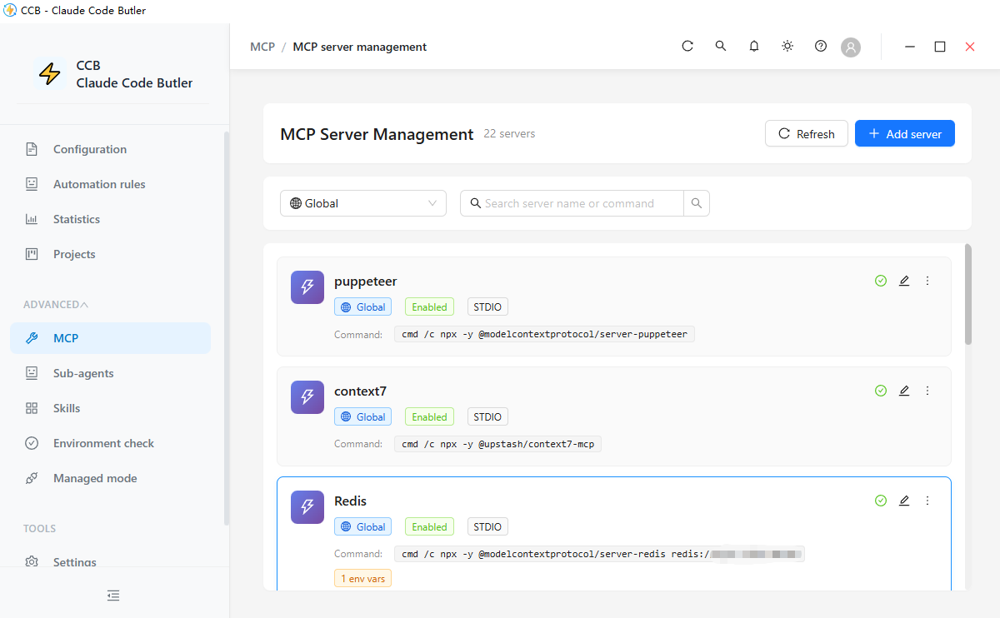
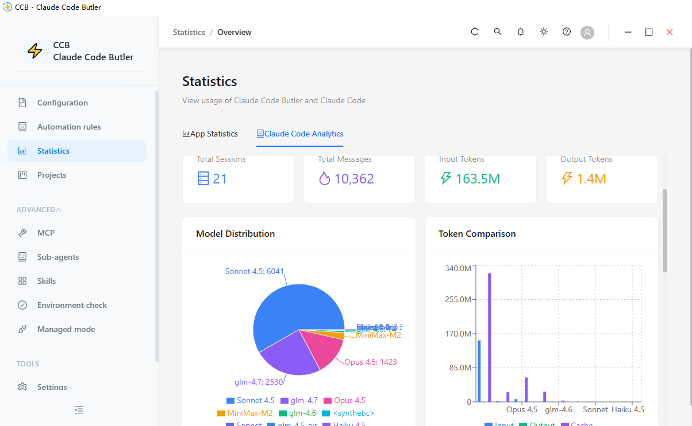
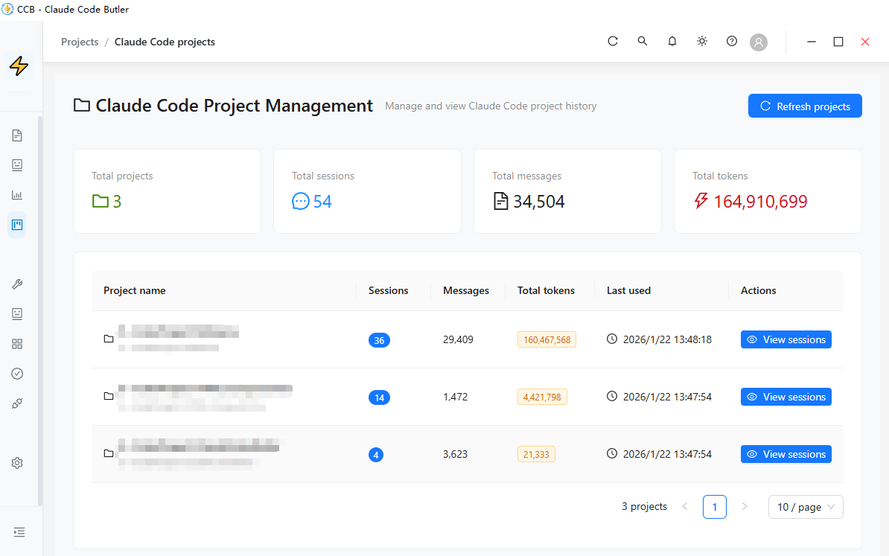
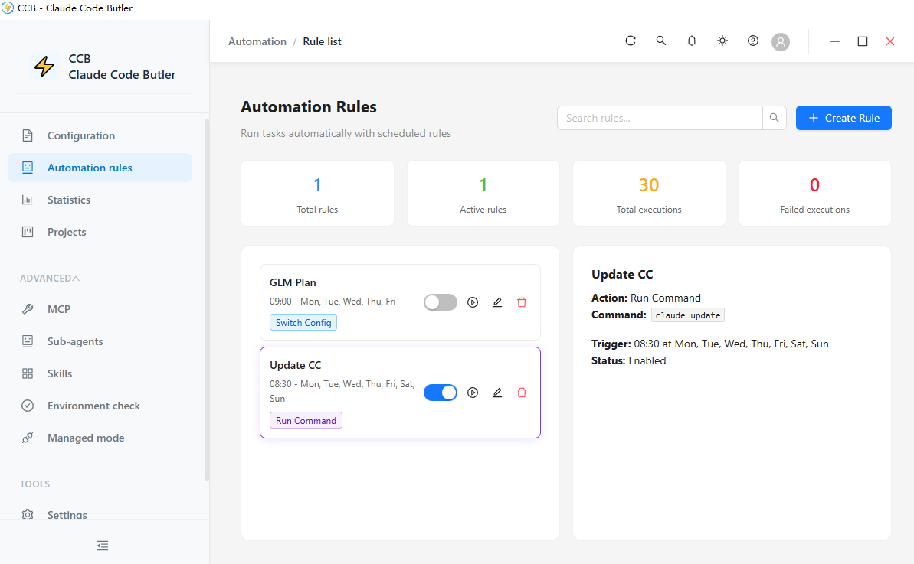
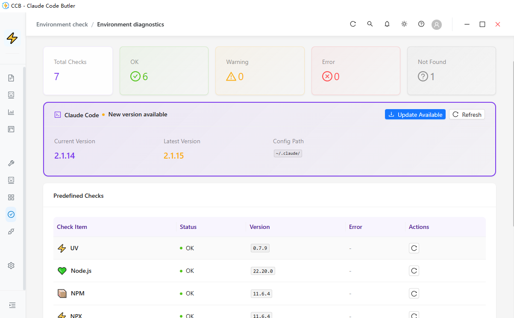
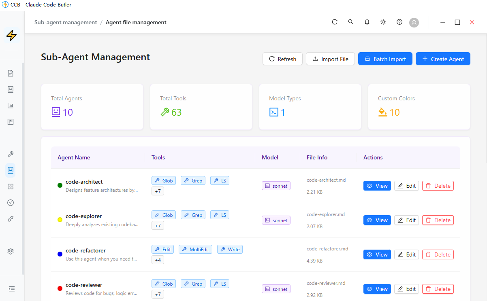
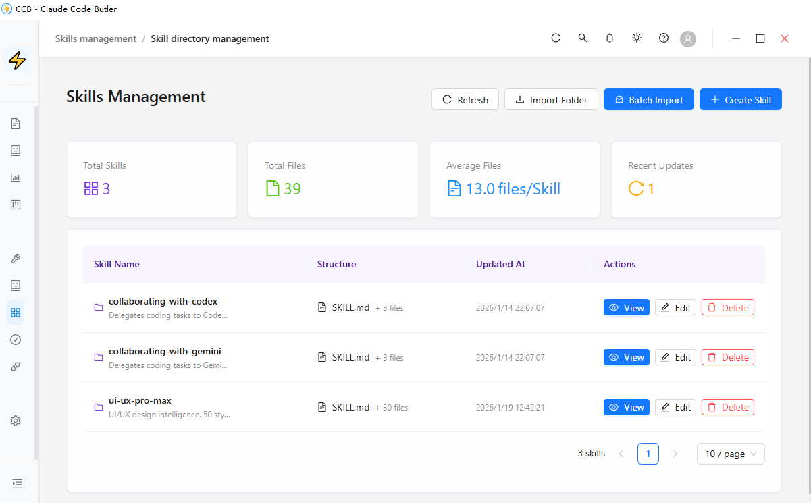

<div align="center">

# ⚡ CCB (Claude Code Butler)

**面向 Claude Code 用户的高效配置管理工具**

[English](./README.md) | 简体中文

[](https://opensource.org/licenses/MIT)
[](https://www.electronjs.org/)
[](https://reactjs.org/)
[](https://www.typescriptlang.org/)

</div>

---

## 📖 简介

CCB (Claude Code Butler) 是基于 Electron + React + TypeScript 构建的现代化配置管理工具，专为 Claude Code 用户提升生产力而设计。通过直观的可视化界面，您可以轻松管理多份配置文件、创建自动化规则、分析使用数据，让 Claude Code 的配置管理简单高效。

### ✨ 核心功能

- 🎯 **配置文件管理** - 可视化管理 Claude Code、MCP 服务器和项目配置
  - 支持配置文件的增删改查
  - JSON Schema 校验确保配置正确性
  - 一键切换不同配置文件
  - 配置备份与恢复

- 🔌 **MCP 服务器管理** - 全面的 Model Context Protocol 服务器管理
  - 可视化管理全局与项目级 MCP 服务器
  - 启用/禁用服务器（归档机制）
  - 服务器配置的增删改查
  - 服务器复制、导入/导出
  - 按项目路径分组展示
  - 实时状态监控

- 🤖 **自动化规则引擎** - 基于触发-条件-动作模式的智能规则系统
  - 定时任务（Cron 表达式）
  - 文件监控触发器
  - 自定义条件判断
  - 多种动作类型（配置切换、命令执行、通知等）

- 📊 **使用统计与分析** - 深入洞察 Claude Code 的使用情况
  - API 调用次数统计
  - Token 用量分析
  - 模型使用分布
  - 可视化图表展示

- 📁 **项目管理** - 集中管理多个开发项目
  - 项目配置关联
  - 快速切换项目配置
  - 项目使用统计

- 🔄 **托管模式** - 内置代理服务器支持
  - API 请求/响应转换
  - 自定义请求处理逻辑
  - 日志与调试

- 🌐 **多语言支持** - 内置中英文界面
- 🎨 **现代化 UI** - 基于 Ant Design 的美观界面
- 💾 **数据安全** - 本地存储保护隐私

---

## 📸 截图

<details open>
<summary>点击展开/收起截图</summary>

### 🎛️ 配置与管理
| 配置管理 | MCP 服务器控制 |
|:---:|:---:|
|  |  |

### 📊 分析与项目
| 用量分析 | 项目管理 |
|:---:|:---:|
|  |  |

### 🚀 自动化与环境
| 自动化规则 | 环境检查 |
|:---:|:---:|
|  |  |

### 🤖 高级功能
| 子 Agent 管理 | 技能库管理 |
|:---:|:---:|
|  |  |

</details>

---

## 🚀 快速开始

### 环境要求

- Node.js >= 20.0.9
- npm >= 9.0.0

### 安装

```bash
# 克隆仓库
git clone https://github.com/NianLog/ClaudeCodeButler.git

# 进入项目目录
cd ClaudeCodeButler

# 安装依赖
npm install
```

### 开发模式

```bash
# 标准模式启动
npm run dev

# 管理员模式启动（部分功能需要）
npm run dev:admin
```

### 构建应用

```bash
# 构建项目
npm run build

# 运行构建后的应用
npm start
```

---

## 📦 打包与分发

### Windows

```bash
npm run dist
```

`release/` 目录输出：
- `CCB-Portable-{version}.exe` - 便携版
- `CCB-{version}-win.zip` - 压缩包

### macOS

```bash
npm run dist:mac
```

输出：
- `CCB-{version}.dmg` - 安装包
- `CCB-{version}-mac.zip` - 压缩包

### Linux

```bash
npm run dist:linux
```

输出：
- `CCB-{version}.AppImage` - AppImage 格式
- `CCB-{version}-linux.tar.gz` - 压缩包

### 全平台

```bash
npm run dist:all
```

---

## 🛠️ 技术栈

### 前端

- **框架**: React 18.2 + TypeScript 5.3
- **UI 库**: Ant Design 5.12
- **状态管理**: Zustand 4.4
- **代码编辑器**: Monaco Editor 0.54
- **图表**: Recharts 2.8
- **构建工具**: Vite 5.0 + electron-vite 2.0

### 后端

- **运行时**: Electron 32.0
- **文件监控**: Chokidar 3.5
- **任务调度**: node-cron 3.0
- **日志**: Winston
- **代理服务**: Express 5.1

### 开发工具

- **测试**: Vitest 1.0
- **Lint**: ESLint + TypeScript ESLint
- **格式化**: Prettier
- **打包**: electron-builder 24.9

---

## 📚 项目架构

### 目录结构

```
ClaudeCodeButler/
├── src/
│   ├── main/              # Electron 主进程
│   │   ├── index.ts       # 主进程入口
│   │   ├── ipc-handlers.ts # IPC 通信处理
│   │   ├── services/      # 业务服务
│   │   └── utils/         # 工具函数
│   ├── preload/           # 预加载脚本
│   ├── renderer/          # React 渲染进程
│   │   ├── src/
│   │   │   ├── components/ # React 组件
│   │   │   ├── store/      # Zustand 状态管理
│   │   │   ├── hooks/      # 自定义 hooks
│   │   │   └── utils/      # 工具函数
│   │   └── index.html
│   ├── shared/            # 共享类型与常量
│   │   ├── types/         # TypeScript 类型定义
│   │   └── constants/     # 常量
│   └── proxy-server/      # 独立代理服务
├── resources/             # 应用资源
├── docs/                  # 项目文档
└── release/               # 构建输出目录
```

### 核心服务

- **ConfigService** - 配置文件管理
- **MCPManagementService** - MCP 服务器管理
- **RuleEngineService** - 自动化规则引擎
- **StatisticsService** - 使用统计服务
- **ProjectManagementService** - 项目管理服务
- **ManagedModeService** - 托管模式服务
- **LogStorageService** - 日志存储服务

### IPC 通信模式

主进程与渲染进程通过标准化的 IPC 模式通信：

```typescript
// 响应格式
{ success: true, data: T }      // 成功
{ success: false, error: string } // 失败
```

---

## 🔧 开发指南

### 开发命令

```bash
# 开发模式
npm run dev              # 标准权限
npm run dev:admin        # 管理员权限

# 构建
npm run build            # 构建到 out/
npm run preview          # 预览构建结果

# 测试
npm test                 # 运行测试
npm run lint             # 代码规范检查
npm run type-check       # 类型检查
```

### 代理服务开发

```bash
cd src/proxy-server

# 开发模式
npm run dev

# 构建
npm run build

# 启动
npm start
```

### 路径别名

项目配置了以下路径别名：

- `@/` → `src/renderer/src/`（渲染进程）
- `@shared/` → `src/shared/`（全局共享）

### 代码规范

- 优先使用 `const`，避免 `var`
- 开启 TypeScript strict 模式
- 所有公开函数添加 JSDoc 注释
- 遵循 ESLint 规则
- 使用 Prettier 格式化代码

---

## 🤝 贡献指南

欢迎任何形式的贡献！无论是报告 bug、提出新特性，还是提交代码改进。

### 贡献流程

1. Fork 本仓库
2. 创建功能分支（`git checkout -b feature/AmazingFeature`）
3. 提交变更（`git commit -m 'Add some AmazingFeature'`）
4. 推送分支（`git push origin feature/AmazingFeature`）
5. 发起 Pull Request

### 提交规范

请遵循以下提交信息格式：

```
<type>: <subject>

<body>
```

**Type:**
- `feat`: 新特性
- `fix`: 修复
- `docs`: 文档
- `style`: 代码风格调整
- `refactor`: 重构
- `perf`: 性能优化
- `test`: 测试相关
- `chore`: 构建/工具链变更

**示例：**
```
feat: add batch import for configuration files

- Support batch import from folder
- Add import progress indicator
- Optimize import performance
```

---

## 📄 许可证

本项目基于 MIT 许可证 - 详见 [LICENSE](LICENSE)

---

## 🙏 致谢

### 开发工具

本项目受益于 [Claude Code](https://claude.com/claude-code) 的辅助开发，大幅提升了开发效率和代码质量。

### 开源项目

感谢以下优秀的开源项目：

- [Electron](https://www.electronjs.org/) - 跨平台桌面应用框架
- [React](https://reactjs.org/) - 用户界面库
- [Ant Design](https://ant.design/) - 企业级 UI 设计语言
- [Monaco Editor](https://microsoft.github.io/monaco-editor/) - 代码编辑器
- [Zustand](https://github.com/pmndrs/zustand) - 状态管理库

---

## 📮 联系方式

- **作者**: NianSir
- **项目主页**: [GitHub](https://github.com/NianLog/ClaudeCodeButler)
- **问题反馈**: [Issues](https://github.com/NianLog/ClaudeCodeButler/issues)

---

<div align="center">

**如果这个项目对你有帮助，欢迎点亮 ⭐ Star!**

Made with ❤️ by NianSir

</div>
