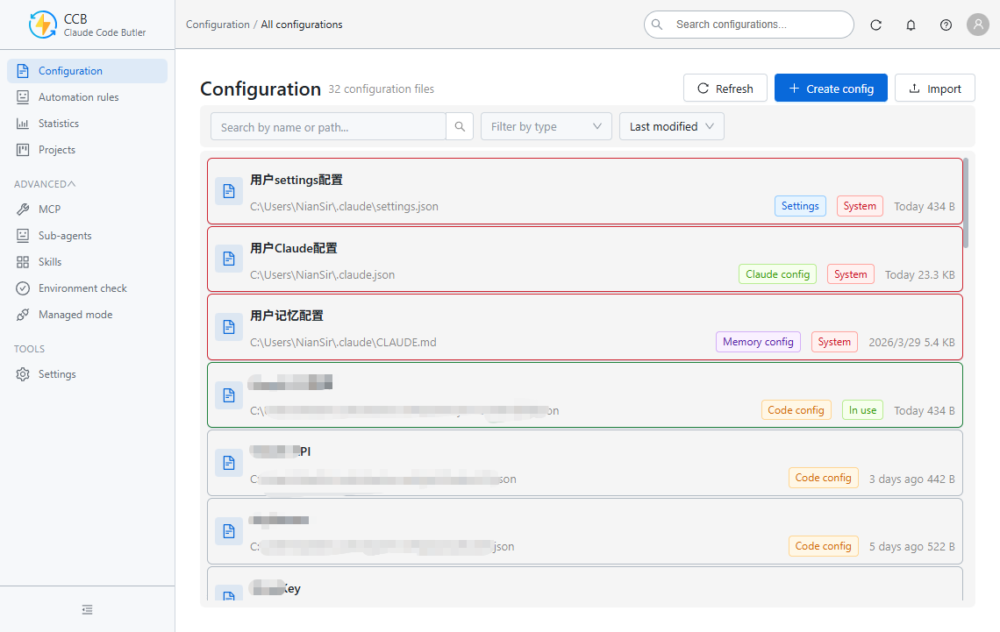
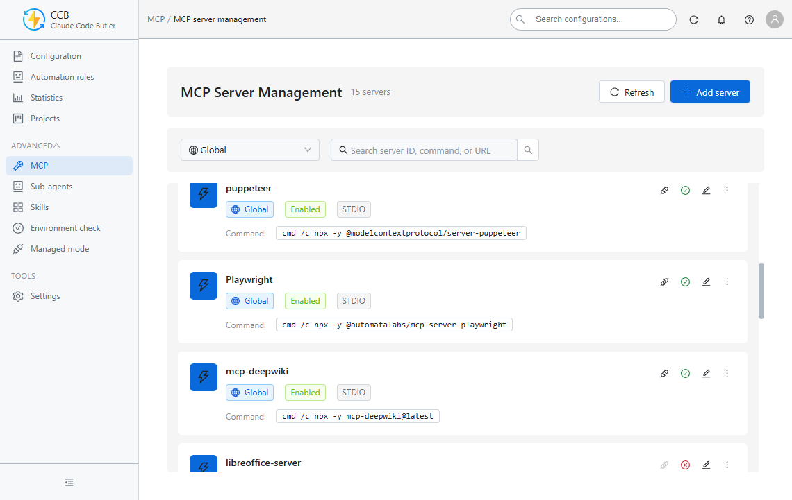
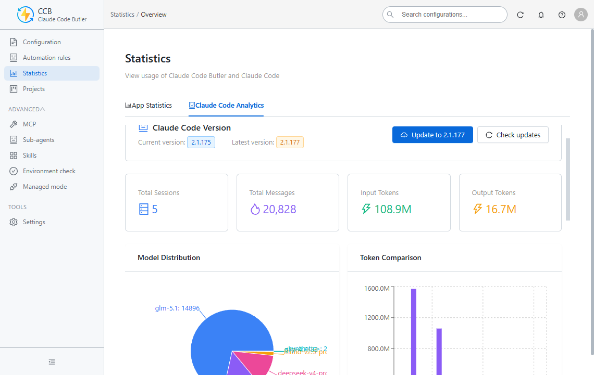
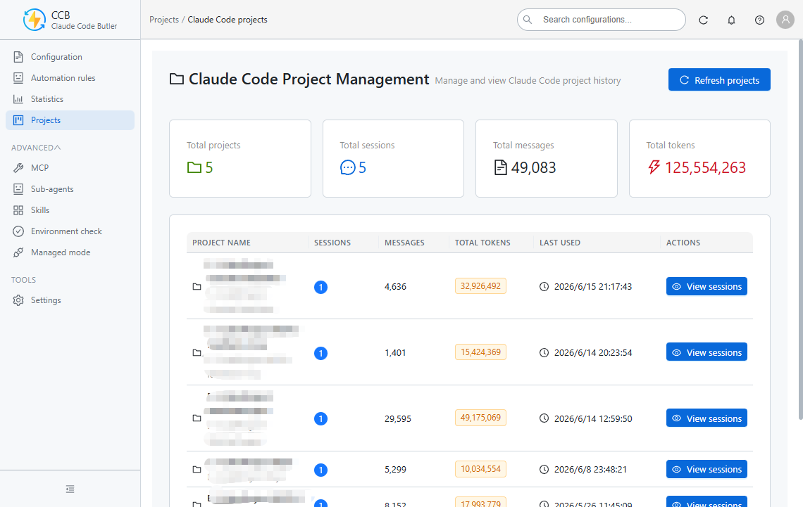
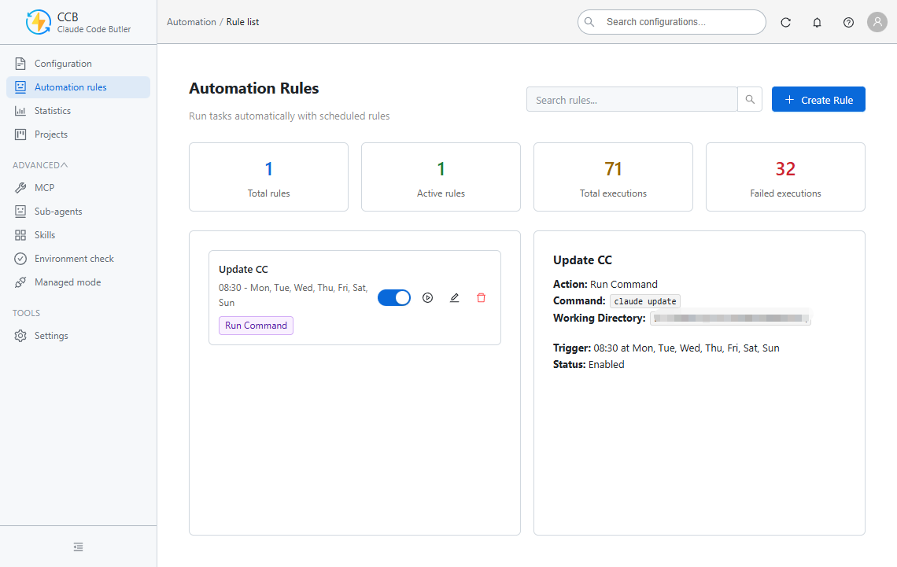
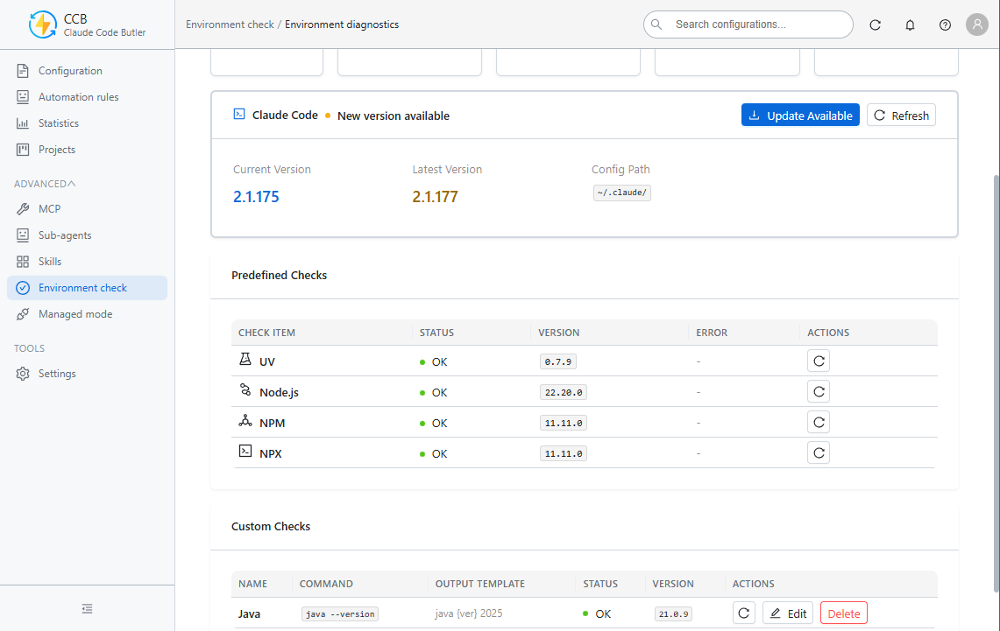
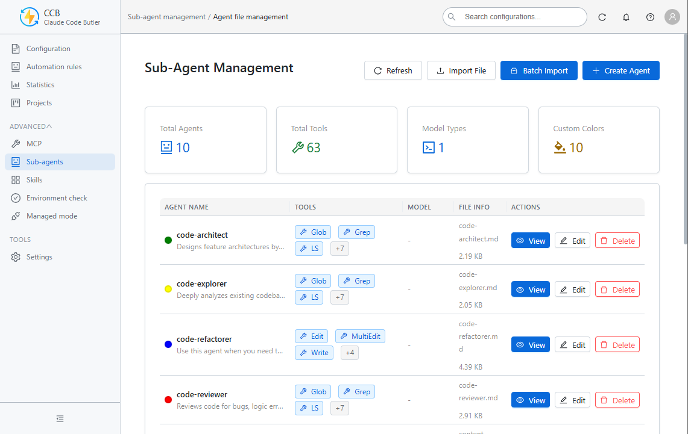
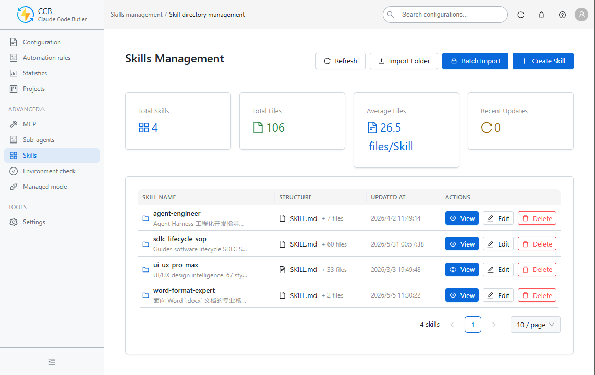

<div align="center">

# ⚡ CCB (Coding Configuration Bridge / 编程配置桥)

**面向 AI Coding 工具的本地优先配置桥**

[English](./README.md) | 简体中文

[](https://opensource.org/licenses/MIT)
[](https://www.electronjs.org/)
[](https://react.dev/)
[](https://www.typescriptlang.org/)

</div>

---

## 📖 简介

CCB（Coding Configuration Bridge / 编程配置桥）是一个基于 Electron、React 和 TypeScript 构建的本地优先桌面应用。当前 `1.4.0` 发布版聚焦 Claude Code 配置资产；开发中的 `1.5.0` foundation 已加入受约束 JSON registry、通用工具检测与只读配置发现，使新增 AI Coding 工具优先通过规则适配，而不是在应用中持续堆叠工具专用分支。

### 项目状态

- **当前发布基线**：`1.4.0`
- **下一里程碑**：`1.5.0` 基础设施开发中
- **v1.5.0 已实施范围**：Claude Code 与 Codex CLI registry adapter、通用检测、registry allowlist 约束的只读 artifact discovery
- **v1.5.0 待实施范围**：通用 validation/edit/backup/restore、UI 迁移与基于实测的 runtime performance 优化
- **安全基线（2026-07-12）**：Semgrep `0 findings / 0 scan errors`，root 与 proxy-server npm audit 均为 `0 vulnerabilities`
- **验证基线**：16 个测试文件共 104 项测试、TypeScript 与 ESLint 检查、root production build 与 proxy-server build 全部通过

在 `1.5.0` 的范围、验收标准与发布计划确认前，package version 继续保持 `1.4.0`，避免把开发目标误标为已发布版本。最新审计证据与已接受的信任边界见 [SECURITY_AUDIT_REPORT.md](./SECURITY_AUDIT_REPORT.md)。

CCB 的新全称已确定为 **Coding Configuration Bridge（编程配置桥）**：`Coding` 保留项目因编程而生的核心语义，`Configuration Bridge` 表达从 Claude Code 专用管理器向规则驱动的多 AI 编程工具配置平台演进。v1.5.0 过渡期间继续兼容 `CCB` 缩写以及现有 `.ccb`、应用 identity 和仓库标识。

### ✨ 核心功能

- 🎯 **配置全生命周期管理**
  - 统一管理 Claude Code 配置、项目配置、MCP 配置和用户偏好文件
  - 支持创建、编辑、复制、导入、导出、备份、恢复与一键切换
  - 同时支持 `JSON` 与 `Markdown` 类型配置，并按真实文件类型做校验
  - 支持在 `设置 -> 编辑器设置` 中配置“新建配置默认模板”，创建时自动预填

- 🔌 **MCP 服务器管理**
  - 在同一个面板中管理全局与项目级 MCP 服务器
  - 支持本地命令型服务器，也支持仅包含 `http` / `url` 等字段的远程服务器
  - 支持启用、禁用、复制、导入、导出、归档与可用性验证
  - 已启用服务器可通过用户配置的全局终端运行时执行可用性验证

- 🧠 **编辑器与设置体验**
  - 基于 Monaco 的编辑器，并采用按需加载运行时以减轻首屏压力
  - 内置格式化、语法校验与弹窗预览，预览和编辑复用同一套编辑器能力
  - 支持默认模板编辑、保存与预览
  - 支持终端预设、主题语言、编辑器行为等偏好设置

- 🤖 **自动化与托管模式**
  - 提供基于触发-条件-动作模型的自动化规则系统
  - 提供托管模式代理能力，支持请求转换、日志、诊断和 Provider 管理
  - 提供 Claude Code 与相关工具的环境检查与版本诊断

- 📊 **运维与洞察**
  - 提供使用分析、模型/Token 统计与项目关联管理
  - 提供 Agent 与 Skill 管理面板
  - 提供本地日志、UTF-8 安全输出和本地优先的数据存储策略

- 🌐 **面向日常使用**
  - 提供中文与英文界面
  - 提供 Windows Portable、ZIP 与 NSIS 安装版分发方式
  - 不强制依赖云端服务，适合本地管理场景

---

## 📸 截图

<details open>
<summary>点击展开/收起截图</summary>

### 🎛️ 配置与管理
| 配置管理 | MCP 服务器控制 |
|:---:|:---:|
|  |  |

### 📊 分析与项目
| 用量分析 | 项目管理 |
|:---:|:---:|
|  |  |

### 🚀 自动化与环境
| 自动化规则 | 环境检查 |
|:---:|:---:|
|  |  |

### 🤖 高级功能
| 子 Agent 管理 | 技能库管理 |
|:---:|:---:|
|  |  |

</details>

---

## 🚀 快速开始

### 环境要求

- Node.js >= 20.19.0（推荐 Node.js 22 LTS）
- npm >= 10.0.0
- 仅在执行本地 Semgrep 审计时需要 Python >= 3.10

### 安装

```bash
# 克隆仓库
git clone https://github.com/NianLog/ClaudeCodeButler.git

# 进入项目目录
cd ClaudeCodeButler

# 按 lockfile 安装应用依赖
npm ci

# 安装独立 proxy-server 依赖
npm ci --prefix src/proxy-server
```

### 开发模式

```bash
# 标准模式启动
npm run dev

# 管理员模式启动（部分环境检查 / 终端流程需要）
npm run dev:admin
```

### 构建与验证

```bash
# 构建应用
npm run build

# 类型检查
npm run type-check

# 单次运行测试（非 watch 模式）
npm run test -- --run

# 审计 root 与 proxy-server 依赖
npm audit --audit-level=low
npm audit --audit-level=low --prefix src/proxy-server

# 启动构建后的应用
npm start
```

---

## 📦 打包与分发

### Windows 产物

```bash
# 单文件 Portable
npm run pack:portable

# 引导式安装包（NSIS）
npm run pack:installer

# ZIP 压缩包
npm run pack:zip

# 目录版，适合快速冒烟验证
npm run pack:dir
```

默认输出到 `release/`：

- `CCB-Portable-{version}.exe` - 单文件便携版
- `CCB-Setup-{version}.exe` - 支持自定义安装目录和快捷方式选项的安装版
- `CCB-{version}-win.zip` - ZIP 压缩包
- `win-unpacked/` - 目录版构建产物

### 分发说明

- Portable 版本虽然便于分发，但 `electron-builder` 的单文件 Portable 方案会在真正显示主界面前先把运行体释放到临时目录，因此在 Windows 上启动速度会明显慢于 `win-unpacked` 或 NSIS 安装版。
- 如果更重视启动体验，推荐优先使用 NSIS 安装版。
- 当前项目保留原本的压缩 Portable 策略，以避免产物体积明显增大。

### 跨平台发布命令

```bash
# 当前平台默认发布目标
npm run dist

# macOS
npm run dist:mac

# Linux
npm run dist:linux

# 全部已配置平台
npm run dist:all
```

---

## 🛠️ 技术栈

### 应用运行时

- **Electron**: 40.10.6
- **electron-vite**: 5.0.0
- **Vite**: 7.3.6
- **TypeScript**: 5.9.3

### 渲染层

- **React**: 18.3.1
- **Ant Design**: 5.27.6
- **Zustand**: 4.5.7
- **Monaco Editor**: 0.55.1，搭配 `@monaco-editor/react` 4.7
- **Recharts**: 2.15.4
- **react-markdown**: 9.1
- **react-syntax-highlighter**: 16.1
- **remark-gfm**: 4.0.1

### 主进程与服务层

- **Express**: 5.1.0
- **Axios**: 1.18.0
- **Chokidar**: 3.6.0
- **node-cron**: 4.6.0
- **js-yaml**: 4.3.0
- **uuid**: 14.0.1

### 工具链与质量保障

- **Vitest**: 4.1.10
- **ESLint**: 8.57.1
- **electron-builder**: 26.15.3
- **patch-package**: 8.0.1
- **Semgrep CLI**: 1.169.0（隔离安装在 root `.venv`）

---

## 📚 项目架构

### 目录结构

```text
ClaudeCodeButler/
├── src/
│   ├── main/                # Electron 主进程、IPC、服务、日志
│   ├── preload/             # 暴露给渲染层的安全桥接
│   ├── renderer/            # React UI、Zustand store、页面、组件、多语言
│   ├── shared/              # 共享类型、常量、默认模板辅助工具
│   └── proxy-server/        # 托管模式代理服务及相关资源
├── scripts/                 # 开发 / 打包辅助脚本
├── resources/               # 图标、截图、打包资源
├── docs/                    # 产品、架构、审计、实现记录文档
├── tests/                   # 单元 / 集成 / 回归测试
└── release/                 # 打包输出目录
```

### 当前模块分层

- **主进程模块**
  - `src/main` 内负责窗口、托盘、调度器、文件监听器与 IPC 启动
  - 业务服务覆盖 `config`、`mcp-management`、`settings`、`environment-check`、`managed-mode`、`agents-management`、`skills-management`、`statistics`、`terminal-management` 等域

- **渲染层模块**
  - 提供 Config、MCP、Automation、Managed Mode、Projects、Environment Check、Settings、Agents、Skills 等功能面板
  - 按业务域拆分 Zustand store，保持界面状态同步可控
  - `CodeEditor` 采用 Monaco 运行时懒加载，并统一格式检查与预览逻辑

- **共享契约层**
  - `src/shared/types` 存放跨进程类型
  - `src/shared/constants` 存放 IPC 常量与应用元信息
  - `src/shared/config-template` 存放新建配置默认模板相关辅助逻辑

### IPC 通信模式

主进程与渲染进程统一使用如下结果结构：

```ts
{ success: true, data: T }
{ success: false, error: string }
```

---

## 🔧 开发指南

### 常用命令

```bash
# 开发
npm run dev
npm run dev:admin

# 构建 / 预览
npm run build
npm run preview

# 质量检查
npm run type-check
npm run lint
npm run test -- --run
npm audit --audit-level=low
npm audit --audit-level=low --prefix src/proxy-server

# 打包
npm run pack
npm run pack:portable
npm run pack:installer
npm run pack:zip
npm run pack:dir
```

### 路径别名

- `@/` → `src/renderer/src/`
- `@shared/*` → `src/shared/*`

### 本地安全审计（Windows Git Bash）

Semgrep 与 Node.js 工具链隔离，安装在 root `.venv`。可通过以下命令重建环境并运行本次审计使用的 rulesets：

```bash
python -m venv .venv
source .venv/Scripts/activate
python -m pip install --upgrade pip
python -m pip install -r requirements-security.txt

semgrep scan \
  --config p/security-audit \
  --config p/owasp-top-ten \
  --config p/javascript \
  --exclude-rule javascript.crypto-js.cryptojs-weak-algorithm.cryptojs-weak-algorithm \
  --exclude-rule javascript.koa.web.cors-default-config-koa.cors-default-config-koa \
  --exclude-rule javascript.express.web.cors-default-config-express.cors-default-config-express \
  --timeout 60 \
  --timeout-threshold 3 \
  --json-output .semgrep/security-audit.json \
  --sarif-output .semgrep/security-audit.sarif \
  .
```

上述 3 条被排除的 registry rules 依赖 Semgrep Pro engine；对应的 CryptoJS、Koa 与 Express CORS 场景已执行人工补偿检查。完整原因与审计记录保存在 [SECURITY_AUDIT_REPORT.md](./SECURITY_AUDIT_REPORT.md)。

### 开发注意事项

- 仅用于渲染层打包的依赖会尽量保留在非运行时依赖范围，减少最终包体积。
- Monaco 不直接进入首屏依赖图，而是在实际打开编辑器时再加载。
- 在 Windows 下，开发链路和日志链路都会显式处理 UTF-8，以降低终端乱码风险。

---

## 🆕 最近更新

### 2026-07-12 安全与质量基线

- 权限提升改为 `execFile` 参数化执行，增加 executable allowlist 与平台级 escaping；权限确认异常时默认拒绝。
- GitHub Actions 固定为完整 commit SHA，降低 mutable tag 带来的供应链风险。
- 移除本地 proxy server 默认全开放的 CORS，并清理不再使用的 CORS dependencies。
- 更新安全相关 dependencies，root 与 proxy-server npm audit 均降至 0 vulnerabilities。
- 迁移至 node-cron 4 的 `createTask` 语义，并补充 enabled/disabled rule 回归测试。
- 恢复 production bundle 中的组件 CSS imports，并清理 PostCSS 检查发现的残缺无效样式片段。
- 增加可复现的 Semgrep 虚拟环境、JSON/SARIF 原始结果流程与持续维护的安全审计报告。

### v1.5.0 基础设施开发中

- 新增声明式 JSON 工具规则库模型、bounded validation 与内置 Claude Code 兼容 adapter。
- 新增只读 Codex CLI adapter、通用 `PATH_EXISTS` / `COMMAND_EXISTS` 检测与 registry allowlist 约束的 artifact discovery。
- 新增需用户明确确认、具备 integrity 校验的规则库安装和 last-known-good rollback；自动检查只获取小型 manifest。
- Settings/About 已加入规则库操作入口，main process 新增完全按需的 performance snapshot exporter。
- 架构、安全协议、性能预算、迁移阶段与已接受的品牌决策见 [`docs/1.5.0`](./docs/1.5.0/README.md)。

### 产品体验更新

- 新增“新建配置默认模板”，可在 `设置 -> 编辑器设置` 中编辑、保存和弹窗预览。
- 模板预览改为弹窗方式，并复用同一套编辑器能力进行格式化与校验。
- 修复了复制配置逻辑，现在会先打开预填编辑器并添加国际化副本后缀，仅在显式保存后才创建新文件。
- 修复了基于 `Markdown` 的偏好配置在预览流程中被错误按 `JSON` 解析的问题。
- 新增 NSIS 安装版打包命令，作为 Portable 单文件方案之外的低等待分发选择。

---

## 🤝 贡献指南

欢迎提交问题反馈、功能建议、文档改进和代码贡献。

### 贡献流程

1. Fork 本仓库
2. 创建分支（`git checkout -b feature/AmazingFeature`）
3. 提交变更（`git commit -m "feat: add amazing feature"`）
4. 推送分支（`git push origin feature/AmazingFeature`）
5. 发起 Pull Request

### 提交约定

请使用 Conventional Commit 前缀：

- `feat`: 新功能
- `fix`: Bug 修复
- `docs`: 文档更新
- `refactor`: 重构
- `perf`: 性能优化
- `test`: 测试
- `chore`: 工具链 / 构建变更

---

## 📄 许可证

本项目使用 MIT License，详见 [LICENSE](LICENSE)。

---

## 🙏 致谢

感谢以下开源项目与工具：

- [Electron](https://www.electronjs.org/)
- [React](https://react.dev/)
- [Ant Design](https://ant.design/)
- [Monaco Editor](https://microsoft.github.io/monaco-editor/)
- [Zustand](https://github.com/pmndrs/zustand)
- [Claude Code](https://claude.com/claude-code)

---

## 📮 联系方式

- **作者**: NianSir
- **项目主页**: [GitHub](https://github.com/NianLog/ClaudeCodeButler)
- **问题反馈**: [Issues](https://github.com/NianLog/ClaudeCodeButler/issues)

---

<div align="center">

**如果这个项目对你有帮助，欢迎点亮 ⭐ Star!**

Made by NianSir

</div>
